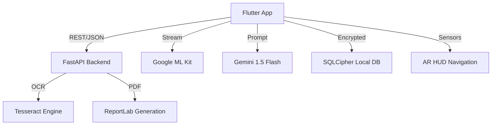

# Maak (معاك) 🤝
> **Empowering administrative accessibility in Tunisia through AI, Computer Vision, and Predictive Analytics.**

Maak is a sophisticated, AI-driven administrative assistant designed specifically to bridge the accessibility gap for people with disabilities in Tunisia. By merging Generative AI, Computer Vision, and real-time AR navigation, Maak transforms how citizens interact with public services.

---

## 🏛️ Project Architecture



---

## 🚀 Key Services & Technical Deep-Dive

### 🧠 Generative AI & Administrative Intent Detection
Maak uses **Google Gemini 1.5 Flash** to provide context-aware administrative guidance. 
- **Intent Matching**: A specialized `ProcedureDetectionService` maps natural language inputs to specific Tunisian administrative workflows (CIN, Cnam, Passport, etc.).
- **Confidence Scoring**: The service uses zero-shot prompting to return structured JSON with confidence ratings, ensuring high-accuracy redirection.

### 👁️ AR & Computer Vision Navigation
The navigation module (`CVNavigationScreen`) provides a heads-up display (HUD) for indoor guidance.
- **Dynamic Tracking**: Leverages `google_mlkit_text_recognition` to identify office signage in real-time.
- **Smoothing Logic**: 
    - **Lerp (Linear Interpolation)**: Floating AR elements use a 0.15 lerp factor to prevent visual jitter and provide smooth movement.
    - **Hysteresis Persistence**: Implements a 1,200ms cooldown timer to maintain target focus even if the text is briefly obscured.
- **HUD Components**: Custom-painted Radar, Crosshair, and Scanline animations provide a high-tech, accessible interface.

### 📊 Visit Optimizer Algorithm
The `OptimizerService` predicts the best time to visit an office by blending historical and live data:
- **The Blended Score Formula**: 
  $$Score = (HistoricalData \times 0.6) + (UserFeedback \times 0.4)$$
- **Procedure Weighting**: Adjusts wait-time predictions based on the complexity of the specific administrative task requested.
- **Interactive Heatmap**: A custom `HeatmapGrid` visualizes peak hours across the Tunisian work week.

### 📠 Intelligent Form Automation
Simplifies the daunting task of filling administrative forms through deep integration between mobile and server layers.
- **Frontend Flow**: ML Kit extracts text blocks from physical forms.
- **Backend Flow**: A **FastAPI** service uses `pytesseract` for high-precision OCR and then maps extracted data to the user’s encrypted profile.
- **Output**: Generates a print-ready, legally formatted PDF using `ReportLab`.

### 🔐 Security & Data Privacy
Given the sensitivity of administrative data, Maak implements multi-layered security:
- **Encryption**: The local SQLite database is fully encrypted using **SQLCipher**.
- **Secure Storage**: API keys and session tokens are managed via **Flutter Secure Storage** (Keychain/Keystore).
- **Privacy First**: Sensitive OCR processing can be targeted to run entirely on-device or on a private backend instance.

---

## 🛠️ Tech Stack

| Layer | Technology |
| :--- | :--- |
| **Frontend** | Flutter, Provider, Google ML Kit, Sensors Plus |
| **Backend** | Python, FastAPI, SQLAlchemy, Tesseract OCR |
| **AI/ML** | Google Gemini 1.5 Flash |
| **Database** | SQLite (SQLCipher), Shared Preferences |
| **Reports** | ReportLab (PDF Generation) |

---

## ⚙️ Installation & Engineering Setup

### 1. System Requirements
- **Flutter SDK**: `^3.4.3`
- **Python**: `3.9+`
- **Tesseract OCR**: Required for backend services. 
    - *Windows*: Download from [UB-Mannheim](https://github.com/UB-Mannheim/tesseract/wiki).
    - *Linux*: `sudo apt install tesseract-ocr`.

### 2. Frontend Setup
```bash
# Clone and enter directory
git clone https://github.com/Yassminefeki/Maak.git && cd Maak

# Fetch dependencies
flutter pub get

# Setup Environments
# Create .env in root with:
# GEMINI_API_KEY=your_key_here
```

### 3. Backend Setup
```bash
cd backend
# Install dependencies
pip install -r recuirement.txt

# Launch FastAPI Dev Server
uvicorn main:app --reload
```

---

## 📂 Project Structure

```text
Maak/
├── backend/            # Python FastAPI microservices
│   ├── main.py         # OCR & PDF generation endpoints
│   └── models.py       # SQLAlchemy ORM schemas
├── lib/
│   ├── core/           # Routing and accessibility themes
│   ├── services/       # AI (Gemini) and AR (Sensors) logic
│   ├── data/           # Repositories for SQLCipher & Feedback
│   ├── screens/        # UI Layers (AR Nav, Chatbot, Optimizer)
│   └── widgets/        # Custom HUD and Heatmap components
└── assets/             # Localization and static resources
```

---

## 🤝 Contributing & Support
Interested in improving accessibility in Tunisia? 
1. Fork the repo.
2. Create your feature branch (`git checkout -b feature/AmazingFeature`).
3. Commit your changes (`git commit -m 'Add AmazingFeature'`).
4. Push to the branch (`git push origin feature/AmazingFeature`).
5. Open a Pull Request.

---

## 📜 License
Maak is distributed under the **MIT License**. See `LICENSE` for more information.

---
*Created with ❤️ for a more inclusive Tunisia.*
