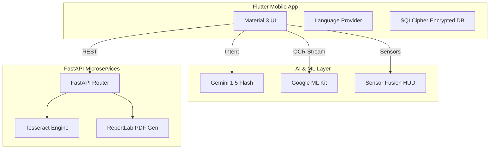

# Maak (معاك) 🤝
> **Redefining Administrative Accessibility in Tunisia through AI, Computer Vision, and Predictive Analytics.**

[](https://flutter.dev)
[](https://www.python.org/)
[](https://opensource.org/licenses/MIT)

---

## 📖 Table of Contents
1. [Vision & Impact](#-vision--impact)
2. [Project Architecture](#-project-architecture)
3. [Core Services Deep-Dive](#-core-services-deep-dive)
    - [🧠 Generative AI Assistant](#-generative-ai-assistant)
    - [👁️ AR & Computer Vision Navigation](#-ar--computer-vision-navigation)
    - [📊 Predictive Visit Optimizer](#-predictive-visit-optimizer)
    - [📠 Intelligent Form Automation](#-intelligent-form-automation)
4. [Technical Specifications](#-technical-specifications)
    - [Frontend Architecture](#frontend-architecture)
    - [Backend Architecture](#backend-architecture)
5. [Database & Data Models](#-database--data-models)
6. [Engineering Setup Guide](#-engineering-setup-guide)
7. [DevOps & CI/CD Lifecycle](#-devops--cicd-lifecycle)
8. [FAQ & Troubleshooting](#-faq--troubleshooting)

---

## 🌟 Vision & Impact

Maak (معاك - meaning "With You") is a socio-technical solution designed to transform the administrative experience for citizens in Tunisia, with a primary focus on individuals with disabilities. 

Tunisian administrative procedures are often complex and physically taxing. Maak bridges this gap by providing:
- **Linguistic Inclusivity**: Full support for Standard Arabic, French, and **Tunisian Darija**.
- **Cognitive Simplification**: Breaking down complex legal jargon into actionable steps.
- **Physical Guidance**: Using AR to eliminate the stress of navigating large government offices.

---

## 🏛️ Project Architecture

The system is built as a distributed intelligence platform, balancing on-device edge AI with scalable cloud-based generative models.



---

## 🚀 Core Services Deep-Dive

### 🧠 Generative AI Assistant
The AI layer is the brain of Maak, powered by **Google Gemini 1.5 Flash**.
- **Liguistic Mapping**: The system uses a `LanguageProvider` and `AppStrings` architecture to manage bidirectional (RTL) Arabic/Darija alongside LTR French.
- **Intent Detection**: The `ProcedureDetectionService` uses zero-shot prompting to categorize user queries into 8+ predefined administrative procedures (CIN, CNAM, Passport, etc.).
- **Voice-First Integration**: Combined with `speech_to_text` and `flutter_tts`, users can navigate the entire app hands-free.

### 👁️ AR & Computer Vision Navigation
The `CVNavigationScreen` is a high-performance AR environment designed for indoor localization.
- **HUD (Heads-Up Display)**: Built using `CustomPaint`, it renders a real-time Radar, Crosshair, and stylized scanlines.
- **Technical Constants**:
    - **Smoothing (Lerp)**: Linear interpolation with a `0.15` factor ensures that AR targets follow the camera feed without visual lag.
    - **Hysteresis Persistence**: A `1200ms` window allows targets to remain "active" in the UI even if the camera briefly loses focus.
- **Math Logic**: Uses `math.atan2` for calculating the relative angle of targets to the user's viewport, driving the direction of the AR guidance arrow.

### 📊 Predictive Visit Optimizer
The `OptimizerService` implements a unique **Blended Scoring Algorithm** to predict office crowd density.
- **Mathematical Model**:
  $$Score = (HistoricalData \times 0.6) + (UserFeedback \times 0.4)$$
- **Procedure Weights**: Different administrative tasks (e.g., renewing a CIN vs. a Birth Certificate) have distinct "time-tax" multipliers applied during calculation.
- **Heatmap Visualization**: A custom `HeatmapGrid` widget visualizes the 0-100 density score across the Tunisian work week.

### 📠 Intelligent Form Automation
Simplifies physical paperwork by digitizing localized forms.
- **OCR Flow**: The `TextRecognitionService` (ML Kit) extracts raw text blocks, which are then transmitted to the Python backend.
- **Backend Mapping**: The FastAPI layer uses `pytesseract` and Levenshtein distance algorithms to map OCR text to the user's `UserProfile` fields.
- **PDF Generation**: `ReportLab` is used to create legally compliant, print-ready PDF documents automatically filled with user data.

---

## 🛠️ Technical Specifications

### Frontend Architecture (Dart/Flutter)
- **State Management**: `Provider` for reactive UI updates and global state.
- **Local Storage**: 
    - **SQLCipher**: For encrypted persistence of sensitive profile data.
    - **Shared Preferences**: For lightweight settings and onboarding flags.
- **Security**: `flutter_secure_storage` for managing device-specific encryption keys.

### Backend Architecture (Python/FastAPI)
- **Framework**: FastAPI (Asynchronous Python) for ultra-low latency.
- **ORM**: SQLAlchemy for managing the User Profile and Feedback databases.
- **OCR Engine**: Tesseract v5.0+ with specialized training for administrative fonts.

---

## 📂 Database & Data Models

### Key Entities
| Model | Purpose | Key Attributes |
| :--- | :--- | :--- |
| **UserProfile** | Secure user data | `cin_number`, `full_name`, `dob`, `address` |
| **BestSlot** | Optimization result | `day`, `time_label`, `blended_score` |
| **DetectedTarget** | CV identification | `text`, `boundingBox`, `confidence` |
| **FeedbackModel** | Crowdsourced data | `office_id`, `rating`, `timestamp` |

---

## ⚙️ Engineering Setup Guide

### 1. External Dependencies
- **Flutter SDK**: `>= 3.4.3`
- **Python**: `3.9 - 3.12`
- **Tesseract OCR**: 
    - *Ubuntu*: `sudo apt install tesseract-ocr`
    - *Windows*: Add `tesseract.exe` to your System PATH and update `main.py` path constant.

### 2. API Configuration
1. Obtain a **Google Gemini API Key** from [AI Studio](https://aistudio.google.com/).
2. Create a `.env` file in the project root:
   ```env
   GEMINI_API_KEY=your_key_here
   ```

### 3. Execution
**Run Backend:**
```bash
cd backend
pip install -r recuirement.txt
uvicorn main:app --reload
```

**Run Mobile:**
```bash
flutter pub get
flutter run
```

---

## 🌍 DevOps & CI/CD Lifecycle

Maak follows modern DevOps practices to ensure development consistency, automated quality control, and streamlined release cycles.

### 🐳 Containerization & Local Development
The backend is fully containerized using **Docker**, which eliminates the "it works on my machine" syndrome.
- **Docker Compose**: Orchestrates the FastAPI application and its environment. Run `docker-compose up` to launch the backend with all system dependencies (Tesseract OCR, etc.) pre-configured.
- **Dockerfile**: Uses a lightweight `python:3.11-slim` base image, optimized for production-grade security and size.

### ⛓️ Continuous Integration (GitHub Actions)
The project utilizes a automated CI/CD pipeline defined in `.github/workflows/main_ci.yml` that triggers on every push to `main` and `dev` branches.

1. **Backend Quality Assurance**:
    - **Linting**: Uses `flake8` to enforce PEP8 standards and catch syntax errors early.
    - **Testing Environment**: Runs in an isolated Ubuntu environment to ensure code portability.
2. **Frontend (Mobile) Validation**:
    - **Static Analysis**: Executes `flutter analyze` to guarantee code quality and adherence to Flutter best practices.
3. **Automated Build & Delivery**:
    - **Backend Artifacts**: Automatically builds a production Docker image and pushes it to the **GitHub Container Registry (GHCR)**.
    - **Staging APKs**: Compiles a debug APK on every successful build, making it immediately available for manual testing and QA feedback.

---

## ❓ FAQ & Troubleshooting

**Q: Why is the AR arrow jumping?**
- *A: Ensure your device supports a Magnetometer (Compass) and Gyroscope. Calibration in a figure-8 motion may be required.*

**Q: OCR is not detecting the form.**
- *A: Check lighting conditions and ensure the form is flat. The backend relies on high-contrast images for `pytesseract` accuracy.*

**Q: Can I use it without internet?**
- *A: AR Navigation and Basic Procedures are available offline. AI Assistant and Visit Optimizer require an active connection.*

---
*Developed for a more inclusive and accessible Tunisian administration.*
